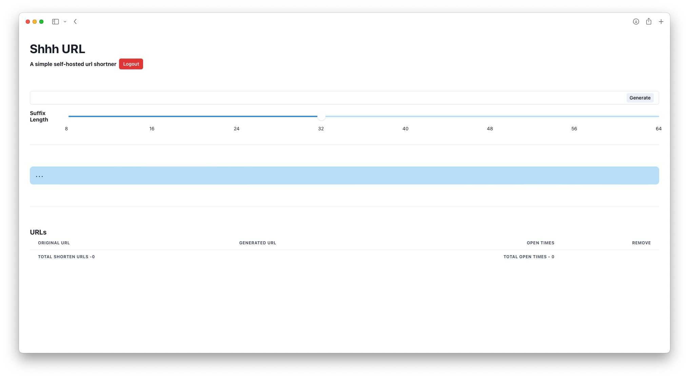

# Shh URL
A simple self-hosted url shortner


## Setup
A simple `.ENV` file to save some usefull variables that will be used by **Shhh URL**.
```
  PASSWORD=<dashboard password>
  SECRET=<a string to encrypt the dashboard password>
  
  BASE_URI=<uri of shh url>
  DATABASE_URI=<uri for the connection with the database>
```


## License

[GNU General Public License v3.0](https://github.com/MichaelCasaDev/shhh-url/blob/main/LICENSE)